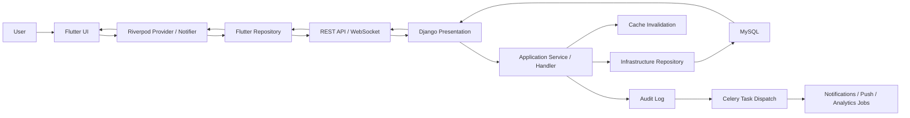
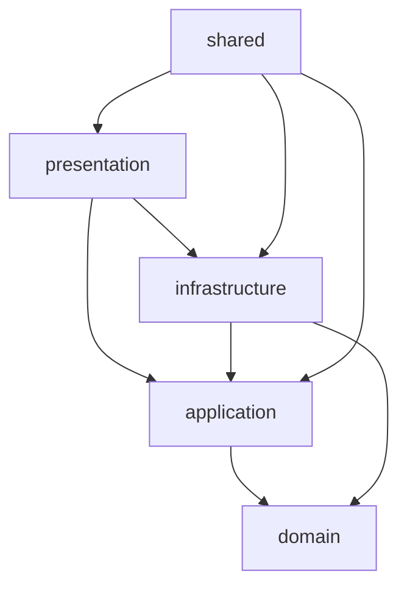

# AI System Design - PlanPal

Generated: 2026-04-19  
Repository root: `D:\Study\DoAnNganh\PlanPal`  
Scope: Django backend, Flutter frontend, Riverpod state, Channels realtime, Celery async, Audit Log, Notifications, Analytics, Budget Tracking.

This document is AI-optimized. It is designed to let an engineer or an AI agent reason about behavior, trace dependencies, predict side effects, and modify the system safely without first reading the entire codebase.

---

## 1. System Mental Model

PlanPal is a layered social planning system. The product is organized around a small set of durable entities and a larger set of behavioral events.

Primary bounded contexts:

- `auth`: users, profile, friendship, device token registration
- `groups`: group lifecycle, membership, roles
- `plans`: plans, activities, schedule, plan lifecycle
- `chat`: conversations, messages, read state
- `audit`: append-only behavioral history
- `notifications`: in-app notifications, unread state, push abstraction, realtime delivery
- `analytics`: pre-aggregated metrics and dashboard queries
- `budgets`: budget + expense tracking per plan
- `locations`: external place lookup
- `shared`: cache, pagination, Celery utilities, cross-cutting abstractions

Core system equation:

```text
User
  -> UI action
  -> Riverpod provider/notifier
  -> repository
  -> REST API or WebSocket
  -> presentation layer
  -> application service / command handler
  -> repository interface
  -> infrastructure repository / ORM
  -> DB state change
  -> synchronous side effects
  -> asynchronous side effects
  -> serializer / DTO mapping
  -> UI state update
```

Behavior model:

```text
User -> Actions -> System -> State changes -> Side effects

Examples
- Create plan -> insert Plan + initialize Budget -> write AuditLog -> queue notification fan-out
- Join group -> insert GroupMembership -> write AuditLog -> notify admins
- Add expense -> insert Expense -> recompute budget summary -> write AuditLog -> maybe queue budget alerts
- Mark notification read -> update Notification -> write AuditLog NOTIFICATION_OPENED -> analytics aggregate later
```

Mermaid overview:



Key design rule:

- request-time reads stay cheap
- durable state lives in MySQL
- audit logs are the canonical behavioral trace
- analytics dashboard reads only pre-aggregated `DailyMetric` rows
- background work is delegated to Celery

---

## 2. Domain Model Graph

Core entity graph:

```text
User
 ├── creates -> Plan
 ├── belongs to -> GroupMembership
 ├── participates in -> Conversation
 ├── sends -> ChatMessage
 ├── receives -> Notification
 ├── owns -> UserDeviceToken
 ├── writes -> AuditLog
 ├── records -> Expense
 └── relates to -> Friendship

Friendship
 ├── connects -> User A
 └── connects -> User B

Group
 ├── has many -> GroupMembership
 ├── has one -> admin User
 ├── has many -> Plan
 └── has one group conversation -> Conversation

GroupMembership
 ├── belongs to -> User
 ├── belongs to -> Group
 └── has role -> admin | member

Plan
 ├── belongs to -> creator User
 ├── optionally belongs to -> Group
 ├── has many -> PlanActivity
 ├── has exactly one -> Budget
 ├── has many -> Expense
 ├── has many -> AuditLog (logical scope)
 └── can trigger -> Notification

PlanActivity
 └── belongs to -> Plan

Budget
 └── belongs to -> Plan (one-to-one)

Expense
 ├── belongs to -> Plan
 └── belongs to -> User

Conversation
 ├── direct: has -> user_a, user_b
 ├── group: belongs to -> Group
 └── has many -> ChatMessage

ChatMessage
 ├── belongs to -> Conversation
 ├── belongs to -> sender User
 └── has many -> MessageReadStatus

AuditLog
 ├── belongs to -> acting User (nullable for some system actions)
 ├── points to -> resource_type + resource_id
 └── carries -> metadata JSON

Notification
 ├── belongs to -> User
 ├── has type -> NotificationType
 └── carries -> data JSON

UserDeviceToken
 └── belongs to -> User

DailyMetric
 └── aggregates -> AuditLog + Notification activity per day
```

Important logical relationships:

- Every `Plan` must have exactly one `Budget`.
- `Expense` is always scoped to a `Plan`.
- `BudgetSummary` is derived, not stored.
- `Plan` audit history logically includes direct plan logs and legacy `budget` / `expense` logs via `metadata.plan_id`.

---

## 3. Dependency Graph (Critical)

### 3.1 Layer rule

Conceptual direction:

```text
Presentation -> Application -> Domain
Infrastructure -> Application + Domain
Shared -> imported by all layers as utility/port abstractions
```

Important nuance:

- Domain is framework-independent.
- Application logic avoids ORM.
- Infrastructure owns Django ORM, Celery task implementations, Channels consumers, push adapters.
- Presentation owns DRF views and serializers. Some serializers read ORM models directly as boundary adapters. This is an allowed edge in this repo, but services and handlers must stay ORM-free.

### 3.2 Backend module map



Actual module families:

- `planpals/<context>/domain/*`
  - pure enums, entities, validation helpers, events
- `planpals/<context>/application/*`
  - services, command handlers, repository interfaces, factories
- `planpals/<context>/infrastructure/*`
  - Django models, ORM repositories, Celery tasks, Channels publishers/consumers
- `planpals/<context>/presentation/*`
  - DRF views, serializers, permissions
- `planpals/shared/*`
  - cache ports/keys, pagination, exception mapping, event and realtime helpers

Critical cross-context dependencies:

- `plans -> groups`
  - group plan membership and admin checks
- `plans -> audit`
  - create/update/delete/complete plan audit logs
- `plans -> budgets`
  - create plan initializes one budget row
- `groups -> auth`
  - friendship validation and user identity
- `groups -> chat`
  - group messaging actions
- `groups -> audit`
  - join/leave/change role/delete group audit logs
- `audit -> notifications`
  - audit factory wires notification dispatcher closure
- `notifications -> audit`
  - mark-read and read-all emit `NOTIFICATION_OPENED`
- `analytics -> audit + notifications`
  - daily aggregation reads audit logs and notification rows
- `budgets -> plans + groups`
  - budget and expense permissions are plan/group scoped
- `budgets -> audit + notifications`
  - budget updates and expenses write audit logs and may queue notifications

### 3.3 Circular dependency policy

The codebase avoids hard architectural cycles in core logic, but there is one intentional event loop:

```text
business action -> AuditLog -> notification dispatcher
notification read -> AuditLog NOTIFICATION_OPENED
analytics aggregate -> consumes audit logs later
```

This loop is acceptable because:

- it is event-driven, not synchronous business recursion
- integration is wired through factories and tasks
- repositories and domain models stay separate

Do not bypass this wiring by calling notification side effects directly from views or ORM models.

---

## 4. Sequence Diagrams (Text)

### 4.1 Create plan

```text
User
 -> Flutter PlanFormPage
 -> PlanRepository.createPlan()
 -> POST /api/v1/plans/
 -> PlanViewSet.create()
 -> PlanService.create_plan()
 -> CreatePlanHandler.handle()
 -> PlanRepository.save_new()
 -> DB insert Plan
 -> BudgetService.initialize_plan_budget(plan)
 -> DB insert Budget
 -> AuditLogService.log_action(CREATE_PLAN, resource=plan)
 -> DB insert AuditLog
 -> Audit factory dispatches notification task
 -> return PlanDetailSerializer payload
 -> Flutter updates plan list / navigates to detail
```

### 4.2 Join group

```text
User
 -> Flutter GroupDetailPage
 -> GroupRepository.joinGroup()
 -> POST /api/v1/groups/{id}/join/
 -> GroupViewSet.join()
 -> GroupService.join_group()
 -> JoinGroupHandler.handle()
 -> DB insert GroupMembership
 -> AuditLogService.log_action(JOIN_GROUP, resource=group)
 -> DB insert AuditLog
 -> process_audit_log_notification_task.delay()
 -> return GroupDetailSerializer payload
 -> Flutter refreshes group detail and user groups
```

### 4.3 Send message

```text
User
 -> Flutter ConversationPage
 -> ConversationRepository.sendMessage()
 -> POST /api/v1/conversations/{id}/send_message/
 -> ConversationViewSet.send_message()
 -> ConversationService.create_message()
 -> DB insert ChatMessage
 -> Channels publish to ws/chat/{conversation_id}/
 -> optional push fan-out task
 -> response returns ChatMessageSerializer
 -> Flutter appends message locally
 -> other clients receive websocket event
```

### 4.4 Notification flow

```text
Business action
 -> AuditLogService.log_action(...)
 -> DB insert AuditLog
 -> audit notification dispatcher whitelist check
 -> Celery process_audit_log_notification_task
 -> NotificationService.notify() or notify_many()
 -> DB insert Notification(s)
 -> Channels user notification publish
 -> optional FCM push send
 -> Flutter NotificationWebSocketService receives event
 -> notificationsProvider + unreadCountProvider update state
```

### 4.5 Expense flow

```text
User
 -> Flutter AddExpenseForm
 -> BudgetRepository.addExpense()
 -> POST /api/v1/plans/{id}/expenses/
 -> PlanExpenseListCreateView.post()
 -> BudgetService.add_expense()
 -> ExpenseRepository.create_expense()
 -> DB insert Expense
 -> Budget summary recomputed
 -> AuditLogService.log_action(CREATE_EXPENSE, resource=plan, entity_type=expense)
 -> Celery process_expense_notifications_task.delay()
 -> return {expense, summary, warnings}
 -> Flutter refreshes budget summary and expense feed
```

---

## 5. Event Flow Map

System event map:

| Event | Trigger | Immediate State Change | Side Effects |
|---|---|---|---|
| `PlanCreated` | valid plan create | insert `Plan`, initialize `Budget` | write audit log, schedule notifications, schedule plan tasks |
| `PlanUpdated` | valid plan update | update `Plan` | write audit log, invalidate plan cache, notify participants |
| `PlanCompleted` | plan completion flow | `Plan.status = completed` | write `COMPLETE_PLAN` audit log, analytics picks it up later |
| `GroupJoined` | join group | insert `GroupMembership` | write audit log, notify admins |
| `GroupLeft` | leave group | delete membership | write audit log, notify admins |
| `RoleChanged` | admin changes member role | update membership role | write audit log, notify affected user |
| `NotificationSent` | notification service | insert `Notification` row(s) | websocket publish, optional push |
| `NotificationOpened` | mark read / read all | update `Notification.is_read` | write `NOTIFICATION_OPENED` audit log |
| `BudgetUpdated` | budget upsert | update `Budget` | invalidate budget cache, write audit log |
| `ExpenseCreated` | expense add | insert `Expense` | invalidate budget + plan summary cache, write audit log, maybe queue alerts |
| `DailyMetricsAggregated` | Celery beat at 02:15 | upsert `DailyMetric` | invalidate analytics cache |

Important event rule:

- Notifications are not created for every audit action.
- Audit-to-notification dispatch is explicitly whitelisted in `notifications/application/factories.py`.

---

## 6. State Transitions

### 6.1 Plan state machine

Persisted field: `Plan.status`

```text
upcoming -> ongoing -> completed
upcoming -> cancelled
ongoing  -> cancelled
```

Rules:

- Only creator or group admin can modify plan.
- `complete_trip()` writes audit `COMPLETE_PLAN`.
- Celery `plan_status` queue may advance state based on schedule.

### 6.2 Friendship state machine

Persisted field: `Friendship.status`

```text
pending -> accepted
pending -> rejected (tracked via FriendshipRejection + status path)
pending -> blocked
accepted -> blocked
blocked -> unblocked (relationship removed or changed by service flow)
```

Rules:

- cannot send friend request to self
- cannot send duplicate pending request
- accepted friendship is required for group initial member validation

### 6.3 Group membership state

There is no persisted `pending` membership state. Membership is presence-based.

```text
not_member -> member
not_member -> admin
member -> admin
admin -> member (only if another admin remains)
member/admin -> removed (row deleted)
```

Rules:

- `GroupMembership` is unique on `(user, group)`
- a group must always have at least one admin
- `GroupCreateSerializer` requires `initial_members` and at least 2 friend IDs

### 6.4 Notification state

Persisted fields: `is_read`, `read_at`

```text
unread -> read
```

Rules:

- read is monotonic
- `mark_all_as_read()` marks all unread rows for the current user
- notification open analytics is derived from audit logs, not from notification row counts alone

### 6.5 Budget status

`Budget` has no explicit status field. Operational state is derived:

```text
normal      : spent_percentage < 80
near_limit  : 80 <= spent_percentage < 100
over_budget : spent_percentage >= 100
```

Rules:

- `Expense.amount > 0`
- every plan has one budget row
- updating budget does not delete history

---

## 7. Data Flow Pipeline

### 7.1 Standard request path

```text
Flutter UI
 -> Riverpod provider / notifier
 -> Flutter repository
 -> ApiClient (Dio)
 -> Django view / viewset
 -> serializer validates request
 -> application service / handler
 -> repository interface
 -> ORM repository
 -> DB
 -> cache invalidation / websocket publish / task enqueue
 -> serializer builds response
 -> DTO parsing in Flutter
 -> provider state update
 -> widget rebuild
```

### 7.2 Serialization and DTO mapping

Backend:

- DRF serializers validate input at the boundary
- application services work with domain-level values or ORM-backed entities returned by repositories
- response serializers define stable API shape

Frontend:

- repositories map JSON -> DTOs
- `parseServerDateTime()` normalizes server timestamps
- DTOs hide API shape differences from widgets

### 7.3 Cache placement

Cache is used only for read optimization:

- user profile
- plan summary
- group detail
- budget summary
- analytics summary / time series / top entities

Write operations update DB first, then invalidate or version-bump cache.

---

## 8. API Contract Map

Base path: `/api/v1`

Pagination styles:

- Standard DRF lists: `count`, `next`, `previous`, `results`
- Notifications and audit logs: custom cursor pagination
- Budget expenses: custom page-number pagination
- Conversation list: custom non-paginated `{conversations, count}`

### 8.1 Authentication and users

| Endpoint | Request | Response | Notes |
|---|---|---|---|
| `POST /o/token/` | OAuth2 password grant fields | access + refresh token payload | login |
| `POST /api/v1/auth/logout/` | bearer token | `{message}` | logout |
| `POST /api/v1/users/` | username, email, password, password_confirm, profile fields | created user | registration |
| `GET /api/v1/users/` | optional filters | paginated user list | list/search support via separate route |
| `GET /api/v1/users/profile/` | none | full current user profile | includes `is_staff` |
| `PUT/PATCH /api/v1/users/update_profile/` | profile fields | updated user profile | current user only |
| `GET /api/v1/users/search/` | `q` | list of users | custom search |
| `POST /api/v1/users/register_device_token/` | `fcm_token`, `platform` | `{message, token_id}` style ack | persists `UserDeviceToken` |
| `GET /api/v1/users/my_plans/` | none | list/paginated plans | current user scope |
| `GET /api/v1/users/my_groups/` | none | list groups | current user scope |
| `GET /api/v1/users/my_activities/` | none | list activities | current user scope |
| `POST /api/v1/users/set_online_status/` | online flag | status ack | online presence |
| `GET /api/v1/users/friendship_stats/` | none | counts | social stats |
| `GET /api/v1/users/recent_conversations/` | none | recent conversations | profile shortcut |
| `GET /api/v1/users/unread_count/` | none | unread message count | messaging badge |
| `GET /api/v1/users/{id}/` | none | user detail | user summary/detail mix |
| `GET /api/v1/users/{id}/friendship_status/` | none | friendship state | current user vs target |
| `DELETE /api/v1/users/{id}/unfriend/` | none | ack | remove friendship |
| `POST /api/v1/users/{id}/block/` | none | ack | block user |
| `DELETE /api/v1/users/{id}/unblock/` | none | ack | unblock user |

### 8.2 Friendship

| Endpoint | Request | Response | Notes |
|---|---|---|---|
| `POST /api/v1/friends/request/` | `friend_id`, optional `message` | friendship/request payload | creates pending friendship |
| `GET /api/v1/friends/requests/` | none | list pending requests | incoming/outgoing as serializer context |
| `POST /api/v1/friends/requests/{id}/action/` | `action=accept|reject|cancel` | updated friendship result | accept path fixed to use correct event args |
| `GET /api/v1/friends/` | none | friends list | accepted friendships only |

### 8.3 Groups

| Endpoint | Request | Response | Notes |
|---|---|---|---|
| `GET /api/v1/groups/` | optional filters | paginated or list groups | group summary |
| `POST /api/v1/groups/` | `name`, `description`, media, `initial_members:[uuid,...]` | `GroupDetailSerializer` payload | `initial_members` required, at least 2 friend IDs |
| `GET /api/v1/groups/{id}/` | none | `GroupDetailSerializer` | object permission checked before cached detail |
| `PUT/PATCH /api/v1/groups/{id}/` | editable group fields | updated group detail | admin only |
| `DELETE /api/v1/groups/{id}/` | none | ack | owner/admin delete path |
| `POST /api/v1/groups/{id}/join/` | none | updated group detail | authenticated user |
| `GET /api/v1/groups/my_groups/` | none | user groups | current user |
| `GET /api/v1/groups/created_by_me/` | none | created groups | current user |
| `GET /api/v1/groups/search/` | `q` | search results | custom |
| `POST /api/v1/groups/{id}/add_member/` | target user data | ack/detail | admin only |
| `POST /api/v1/groups/{id}/leave/` | none | ack | member only |
| `POST /api/v1/groups/{id}/remove_member/` | `user_id` | ack/detail | admin only |
| `POST /api/v1/groups/{id}/change_role/` | `user_id`, `role` | updated membership | admin only |
| `GET /api/v1/groups/{id}/admins/` | none | admin list | member only |
| `GET /api/v1/groups/{id}/plans/` | none | group plans | member only |
| `POST /api/v1/groups/{id}/send_message/` | message payload | message result | group message shortcut |
| `POST /api/v1/groups/{id}/send_message_with_notification/` | message payload | message result | group message + notifications |
| `GET /api/v1/groups/{id}/recent_messages/` | none | recent messages | member only |
| `GET /api/v1/groups/{id}/unread_count/` | none | unread count | member only |

### 8.4 Plans and activities

| Endpoint | Request | Response | Notes |
|---|---|---|---|
| `GET /api/v1/plans/` | standard filters, pagination | paginated plan summaries/details | list |
| `POST /api/v1/plans/` | title, description, dates, `group_id?`, `is_public` | `PlanDetailSerializer` payload | returns `id` and detail fields |
| `GET /api/v1/plans/{id}/` | none | `PlanDetailSerializer` | plan detail |
| `PUT/PATCH /api/v1/plans/{id}/` | mutable plan fields | updated `PlanDetailSerializer` | creator or group admin |
| `DELETE /api/v1/plans/{id}/` | none | ack | owner only |
| `GET /api/v1/plans/my_plans/` | none | list plans | current user |
| `GET /api/v1/plans/joined/` | none | joined plans | public/collab scope |
| `GET /api/v1/plans/public/` | none | public plans | discoverability |
| `POST /api/v1/plans/{id}/join/` | none | joined plan result | public plan only |
| `GET /api/v1/plans/{id}/activities_by_date/?date=YYYY-MM-DD` | date | `{date, activities}` style payload | current contract fixed |
| `GET /api/v1/plans/{id}/collaborators/` | none | collaborator list | plan access required |
| `GET /api/v1/plans/{id}/summary/` | none | cached summary | plan access required |
| `GET /api/v1/plans/{id}/schedule/` | none | schedule payload | plan access required |
| `POST /api/v1/plans/{id}/create_activity/` | activity fields | created activity | modifier only |
| `PUT/PATCH /api/v1/plans/{id}/activities/{activity_id}/` | activity updates | updated activity | modifier only |
| `DELETE /api/v1/plans/{id}/activities/{activity_id}/` | none | ack | modifier only |
| `POST /api/v1/plans/{id}/activities/{activity_id}/complete/` | none | toggled activity | modifier only |
| `POST /api/v1/plans/{id}/add_activity_with_place/` | place-backed activity fields | created activity | place helper |
| `GET /api/v1/activities/` | standard pagination | activity list | separate viewset |
| `GET /api/v1/activities/by_plan/` | `plan_id` | plan activities | custom |
| `GET /api/v1/activities/by_date_range/` | range params | activities | custom |
| `GET /api/v1/activities/upcoming/` | none | upcoming activities | custom |
| `GET /api/v1/activities/search/` | `q` and filters | search results | custom |

### 8.5 Chat

| Endpoint | Request | Response | Notes |
|---|---|---|---|
| `GET /api/v1/conversations/` | optional `q` | `{conversations: [...], count}` | not standard DRF pagination |
| `POST /api/v1/conversations/create_direct/` | `user_id` | `{conversation, created}` | direct conversation |
| `GET /api/v1/conversations/{id}/` | none | `ConversationSerializer` | retrieve |
| `GET /api/v1/conversations/{id}/messages/` | `limit`, `before_id?` | `{messages, has_more, next_cursor, count}` | read-only fetch, no implicit mark-read |
| `POST /api/v1/conversations/{id}/send_message/` | message payload | `ChatMessageSerializer` | send into conversation |
| `POST /api/v1/conversations/{id}/mark_read/` | `message_ids:[]` | `{success, message}` | explicit read mutation |
| `POST /api/v1/messages/` | group message payload incl. `group_id` | `ChatMessageSerializer` | legacy group-message create path |
| `GET /api/v1/messages/{id}/` | none | `ChatMessageSerializer` | retrieve |
| `PUT/PATCH /api/v1/messages/{id}/` | editable message content | updated message | edit |
| `DELETE /api/v1/messages/{id}/` | none | ack | soft delete |
| `GET /api/v1/messages/by_group/` | `group_id`, pagination params | `{messages, has_more, next_cursor, count}` | group feed |
| `GET /api/v1/messages/search/` | `q`, optional `group_id` | message search results | custom |
| `GET /api/v1/messages/recent/` | limit | recent messages | custom |

Stable chat contract details:

- `Conversation.last_message.id` is nullable in Flutter DTO but backend now returns a real ID whenever annotated last message exists.
- `last_message.message_type` is derived from real annotated message data, not hard-coded.

### 8.6 Audit log

| Endpoint | Request | Response | Notes |
|---|---|---|---|
| `GET /api/v1/audit-logs/` | `user_id`, `action`, `resource_type`, `date_from`, `date_to`, `cursor`, `page_size` | `{next, previous, has_more, page_size, results}` | custom cursor page |
| `GET /api/v1/audit-logs/resource/{resource_type}/{resource_id}/` | same filters | same page shape plus `resource_type`, `resource_id` | permission-gated |

Audit response notes:

- serializer includes actor user summary
- plan-scoped queries include direct plan logs and legacy budget/expense logs by `metadata.plan_id`

### 8.7 Notifications

| Endpoint | Request | Response | Notes |
|---|---|---|---|
| `GET /api/v1/notifications/` | `is_read?`, `cursor?`, `page_size?` | `{next, previous, has_more, page_size, unread_count, results}` | custom cursor page |
| `GET /api/v1/notifications/unread-count/` | none | `{unread_count}` | badge endpoint |
| `PATCH /api/v1/notifications/{id}/read/` | none | notification or ack payload | marks one read |
| `PATCH /api/v1/notifications/read-all/` | none | `{message, updated_count}` | marks all read |

Stable notification contract:

- list response always carries `unread_count`
- websocket events mirror list mutations: `notification.created`, `notification.read`, `notification.read_all`

### 8.8 Analytics

| Endpoint | Request | Response | Notes |
|---|---|---|---|
| `GET /api/v1/analytics/summary/?range=30d` | `range in {7d,30d,90d,180d}` | dashboard summary payload | staff only |
| `GET /api/v1/analytics/timeseries/?metric=dau&range=30d` | metric + range | `{metric, range, points:[{date,value}]}` | staff only |
| `GET /api/v1/analytics/top/?range=30d&limit=5` | range + limit | `{range, plans:[...], groups:[...]}` | staff only |

Summary payload keys:

- `dau`
- `mau`
- `plan_creation_rate`
- `plan_completion_rate`
- `group_join_rate`
- `notification_open_rate`
- `totals.plans_created`
- `totals.plans_completed`
- `totals.expenses_created`
- `totals.expense_total_amount`
- `totals.group_joins`
- `totals.notifications_sent`
- `totals.notifications_opened`

### 8.9 Budget tracking

| Endpoint | Request | Response | Notes |
|---|---|---|---|
| `GET /api/v1/plans/{plan_id}/budget/` | none | `BudgetSummary` | creator or group member |
| `POST /api/v1/plans/{plan_id}/budget/` | `total_budget`, `currency` | updated `BudgetSummary` | creator or group admin |
| `GET /api/v1/plans/{plan_id}/expenses/` | `category`, `user_id`, `sort_by`, `sort_direction`, `page`, `page_size` | `{count, total_pages, current_page, page_size, next, previous, results}` | page-number pagination |
| `POST /api/v1/plans/{plan_id}/expenses/` | `amount`, `category`, `description` | `{expense, summary, warnings}` | creator or group member |

Budget summary shape:

```json
{
  "budget_id": "uuid",
  "plan_id": "uuid",
  "currency": "VND",
  "total_budget": "1200000.00",
  "total_spent": "500000.00",
  "remaining_budget": "700000.00",
  "spent_percentage": 41.67,
  "near_limit": false,
  "over_budget": false,
  "expense_count": 2,
  "breakdown": [
    { "user": { "id": "uuid", "username": "alice", "full_name": "Alice" }, "amount": "300000.00" }
  ],
  "trend": [
    { "date": "2026-04-18", "amount": "500000.00" }
  ]
}
```

### 8.10 Locations

| Endpoint | Request | Response | Notes |
|---|---|---|---|
| `GET /api/v1/location/reverse-geocode/` | lat/lng | place result | external service |
| `GET /api/v1/location/search/` | query | places | external service |
| `GET /api/v1/location/autocomplete/` | query | suggestions | external service |
| `GET /api/v1/location/place-details/` | place id | place detail | external service |

---

## 9. Permission Model

Roles used by the system:

- anonymous
- authenticated user
- friend / pending friend / blocked user
- group member
- group admin
- plan creator
- plan collaborator
- staff user

Action to role map:

| Action | Required role |
|---|---|
| register | anonymous |
| login/logout | authenticated session lifecycle |
| send friend request | authenticated user |
| accept friend request | request receiver |
| create group | authenticated user with at least 2 accepted friends selected |
| edit group | group admin |
| delete group | group owner/admin path |
| add/remove/change member role | group admin |
| join group | authenticated user |
| leave group | group member |
| view group detail | member or authorized path |
| create personal plan | authenticated user |
| create group plan | group member |
| edit plan | creator or group admin |
| delete plan | creator |
| view plan | creator, collaborator, public user, or group member depending on scope |
| add activity | plan modifier |
| join public plan | authenticated user, if public and not already collaborator |
| view notifications | notification owner only |
| mark notifications read | notification owner only |
| view analytics | staff only |
| read audit logs | only if viewer can access underlying resource |
| update budget | plan creator or group admin |
| add expense | plan creator or group member |
| view budget/expenses | plan creator or group member |

Special permission notes:

- `GET /groups/{id}/` explicitly checks object permissions before serving cached detail.
- Audit log access is resource-aware, not global admin-only.
- Analytics is intentionally staff-only on backend and hidden in Flutter for non-staff users.

---

## 10. Caching Flow

Cache key registry lives in `planpalapp/planpals/shared/cache.py`.

Primary keys:

- `v1:user:profile:{user_id}`
- `v1:plan:summary:{plan_id}`
- `v1:group:detail:version:{group_id}`
- `v1:group:detail:{group_id}:r{version}:u{user_id}`
- `v1:budget:summary:{plan_id}`
- `v1:analytics:version`
- `v1:analytics:summary:{range}:r{version}`
- `v1:analytics:timeseries:{metric}:{range}:r{version}`
- `v1:analytics:top:{range}:limit:{limit}:r{version}`

TTL strategy:

- user profile: 120s
- plan summary: 180s
- group detail: 180s
- budget summary: 180s
- analytics summary: 300s
- analytics time series / top: 600s

Flow:

```text
Request
 -> cache lookup
 -> hit: return cached payload
 -> miss: query DB through service/repository
 -> cache write
 -> response
```

Invalidation strategy:

- group mutations:
  - bump `group_detail_version(group_id)`
  - best-effort `delete_pattern(group_detail_pattern(group_id))`
- plan mutations:
  - delete `plan_summary(plan_id)`
- budget / expense mutations:
  - delete `budget_summary(plan_id)`
  - delete `plan_summary(plan_id)` because summary fields depend on expenses
- analytics aggregation:
  - increment `analytics_version`
  - delete old summary keys and pattern

Why versioned keys exist:

- Redis `delete_pattern` is best-effort and backend-dependent
- version bump guarantees hard invalidation even if pattern deletion misses entries

---

## 11. Async Flow (Celery)

Runtime rule:

- test env may use `memory://`
- normal runtime defaults to Redis broker/result backend
- local default if env is absent: `redis://127.0.0.1:6379/0`

Queues:

- `high_priority`
- `default`
- `plan_status`
- `low_priority`

Queue intent:

- `high_priority`: user-triggered fan-out and push-sensitive work
- `default`: general event processing
- `plan_status`: ETA-scheduled plan lifecycle
- `low_priority`: analytics, cleanup, reminders

Key tasks:

| Task | Queue | Purpose |
|---|---|---|
| `send_notification_task` | high_priority | single-user notification |
| `fanout_group_notification_task` | high_priority | bulk notification fan-out |
| `process_audit_log_notification_task` | high_priority | audit -> notification mapping |
| `process_expense_notifications_task` | high_priority | budget alerts and large expense alerts |
| `aggregate_daily_metrics_task` | low_priority | build `DailyMetric` |
| `dispatch_plan_reminders_task` | low_priority | reminder notifications |
| plan start/complete tasks | plan_status | scheduled plan lifecycle |
| cleanup invalid FCM tokens | low_priority | hygiene |
| cleanup expired offline events | low_priority | hygiene |

Beat schedule:

- `02:15` daily: aggregate daily metrics
- `03:00` daily: cleanup expired offline events
- `04:00` Sunday: cleanup invalid FCM tokens
- hourly: dispatch plan reminders

Async flow:

```text
Event
 -> Celery task enqueued
 -> worker consumes from queue
 -> service/repository work
 -> DB / push / websocket side effects
 -> optional retries on transient failures
```

Important operational rule:

- if Celery is down, core writes still succeed
- async side effects become delayed or absent
- dashboard still reads existing `DailyMetric`; it just will not refresh automatically

---

## 12. Frontend State Graph

Frontend architecture:

```text
Widget
 -> Riverpod provider / notifier
 -> repository
 -> ApiClient / WebSocket service
 -> backend
 -> DTO mapping
 -> provider state
 -> widget rebuild
```

Key provider groups:

- auth/session
  - `authNotifierProvider`
  - `sharedPreferencesProvider`
- home/dashboard aggregates
  - `plansNotifierProvider`
  - `groupsNotifierProvider`
  - `conversationListProvider`
  - `unreadCountProvider`
- notifications
  - `notificationsProvider`
  - `unreadCountProvider`
  - websocket service + polling fallback
- analytics
  - `analyticsRangeProvider`
  - `analyticsChartMetricProvider`
  - `analyticsSummaryProvider`
  - `analyticsTimeSeriesProvider`
  - `analyticsTopEntitiesProvider`
- budgets
  - `budgetProvider(planId)`
  - `expensesProvider(ExpenseListQuery)`

Provider behavior notes:

- analytics fetches only the currently selected metric series, not all series
- notifications merge realtime events into the list and poll every 60s as fallback
- expense and notification feeds dedupe by page URL and by item ID when appending

---

## 13. UI State Machine

Common state model used across screens:

```text
loading -> success
loading -> empty
loading -> error
success -> loading (refresh)
success -> error (load more error or mutation error)
```

Feature examples:

- `NotificationListPage`
  - initial loading
  - empty when no notifications
  - inline load-more state
  - optimistic read / read-all update with rollback on failure
- `AnalyticsDashboardPage`
  - guarded by `currentUser.isStaff`
  - loading KPIs and chart
  - empty-style zero chart if no data
  - explicit retry on API error
- `BudgetOverviewPage`
  - loading summary
  - success with progress bar and breakdown
  - refresh after budget update or expense add

UI rule:

- widgets should not interpret raw HTTP payloads directly
- repositories and DTOs own API-shape normalization

---

## 14. Pagination Flow

Three pagination strategies exist.

### 14.1 Standard DRF

Used by many list endpoints.

```text
Request -> {count,next,previous,results} -> repository maps results -> provider replaces or appends
```

### 14.2 Cursor pagination

Used by:

- audit logs
- notifications

Shape:

```json
{
  "next": "absolute-url-or-null",
  "previous": null,
  "has_more": true,
  "page_size": 20,
  "results": []
}
```

Frontend strategy:

- store `nextPageUrl`
- pass absolute `next` URL back to repository
- dedupe page URLs to avoid duplicate requests

### 14.3 Page-number pagination

Used by budget expenses.

Shape:

```json
{
  "count": 53,
  "total_pages": 3,
  "current_page": 1,
  "page_size": 20,
  "next": "absolute-url-or-null",
  "previous": null,
  "results": []
}
```

Frontend merge rule:

- append only items whose IDs are not already present

---

## 15. Performance Model

### 15.1 Backend

Primary optimization techniques:

- indexed ORM models
- `select_related` / `prefetch_related`
- cached read models
- Celery offload for heavy side effects
- pre-aggregated analytics table

Important indexes:

- notifications:
  - `(user, is_read)`
  - `(created_at)`
  - `(type)`
  - `(user, created_at)`
  - `(created_at, id)`
- audit:
  - `(user, created_at)`
  - `(resource_type, resource_id)`
  - `(action)`
  - `(created_at, id)`
- budgets / expenses:
  - budget on plan
  - expense `(plan, created_at)`
  - expense `(user)`
  - expense `(category)`
  - expense `(plan, category)`
  - expense `(created_at, id)`
- analytics:
  - `DailyMetric.date`

### 15.2 Frontend

Performance controls:

- Riverpod `AsyncNotifier` isolates network state
- selected analytics series only
- infinite scroll instead of loading entire feeds
- page URL and ID dedupe prevent duplicate merges
- websocket push avoids unnecessary full refreshes for notifications

### 15.3 Runtime expectations

- analytics requests should be fast because they read `DailyMetric`, not raw `AuditLog`
- notification badge should be fast because unread count is a direct query
- budget summary is cheap because totals are aggregate queries scoped to one plan

---

## 16. Failure Modes

Known failure classes and intended behavior:

| Failure | Cause | Expected handling |
|---|---|---|
| API mismatch | serializer and DTO drift | repository/DTO layer must absorb shape changes; tests should catch it |
| missing migrations | new tables not applied | backend returns `500`; fix by migrating before runtime |
| stale cache | old cached detail after mutation | versioned keys on group/analytics, explicit key delete on plan/budget |
| websocket disconnect | mobile network / server restart | notifications provider continues via polling fallback |
| Celery unavailable | worker down or Redis unavailable | core writes still succeed, async side effects delayed |
| push unavailable | FCM credentials invalid or token bad | in-app notifications still work; token cleanup task removes invalid tokens |
| permission error | unauthorized user hits restricted endpoint | return `403`, UI should show error / hide feature |
| large data volume | long feeds or many notifications | pagination + indexes + dedupe |
| invalid input | serializer validation failure | structured `400` response |
| analytics no data | fresh environment | dashboard returns zeros/empty series rather than computing raw history live |

Failure handling notes:

- profile caching has fallback/self-heal logic and should not hard-fail if cache content is partially stale
- notification websocket URL is derived from `baseUrl` to prevent malformed WS paths
- Celery local runtime is no longer silently downgraded to `memory://` outside tests

---

## 17. Invariants (Very Important)

These invariants must never be violated.

### 17.1 Identity and membership

- A friendship cannot connect a user to themself.
- A user can have at most one friendship record pair with another user.
- A user can have at most one `GroupMembership` per group.
- A group must always have at least one admin.

### 17.2 Plans

- `Plan.plan_type == personal` implies `group is null`.
- `Plan.plan_type == group` implies `group is not null`.
- A user must be a group member to create a group plan for that group.
- A created plan must always have exactly one budget row.

### 17.3 Budgets and expenses

- Every `Expense` belongs to an existing `Plan`.
- Every `Expense` belongs to an existing `User`.
- `Expense.amount > 0`.
- Only plan creator or group admin can update budget.
- Only plan creator or group member can add expenses.
- Budget summary is derived from stored budget + expense rows, never manually edited.

### 17.4 Audit and notifications

- Audit log is append-only behavioral history.
- Notification rows belong to exactly one user.
- `NOTIFICATION_OPENED` must only be emitted from actual read operations.
- Plan-scoped audit feeds must include budget/expense history logically tied to the plan.

### 17.5 Analytics

- Dashboard endpoints must not compute raw audit scans per request.
- `DailyMetric` is the only source for dashboard summary and time series.
- Only staff users may access analytics APIs and UI.

### 17.6 Chat

- Conversation access requires participation or group membership.
- Message read mutation is explicit; fetching messages does not silently mark read.

---

## 18. Extension Rules

Safe extension recipe:

1. Define domain model first.
   - entity / enum / validation helpers in `domain`
2. Define repository interface.
   - keep application depending on abstractions only
3. Implement service or command handler.
   - business rules go here
4. Implement infrastructure repository / model / task / consumer as needed.
5. Add presentation adapter.
   - serializer, view, permission, route
6. Add frontend DTO and repository mapping.
7. Add Riverpod provider or notifier.
8. Add UI page/widget.
9. Decide cross-cutting integration explicitly:
   - should this write audit logs?
   - should it notify users?
   - should it affect analytics aggregates?
   - should it invalidate cache?
10. Add tests.
    - backend service + API contract
    - frontend DTO/provider/UI behavior
11. Update this document.

Rules for safe modifications:

- do not put business logic into Django models
- do not bypass services from views
- do not use ORM directly in application services
- do not add request-time heavy analytics queries
- do not add new side effects without deciding sync vs async placement
- if a new feature changes user-visible behavior, consider audit + notification + analytics touchpoints together

---

## 19. Machine-Readable Summary

```json
{
  "system": "PlanPal",
  "architecture": {
    "backend": "Django + DRF + Channels + Celery",
    "frontend": "Flutter + Riverpod",
    "database": "MySQL",
    "cache": "Redis or LocMem",
    "realtime": "Channels WebSocket",
    "async": "Celery with Redis broker in normal runtime"
  },
  "entities": [
    "User",
    "Friendship",
    "FriendshipRejection",
    "Group",
    "GroupMembership",
    "Plan",
    "PlanActivity",
    "Budget",
    "Expense",
    "Conversation",
    "ChatMessage",
    "MessageReadStatus",
    "AuditLog",
    "Notification",
    "UserDeviceToken",
    "DailyMetric"
  ],
  "core_actions": [
    "register",
    "login",
    "send_friend_request",
    "accept_friend_request",
    "create_group",
    "join_group",
    "leave_group",
    "change_role",
    "create_plan",
    "update_plan",
    "delete_plan",
    "complete_plan",
    "create_activity",
    "send_message",
    "mark_notification_read",
    "update_budget",
    "create_expense"
  ],
  "audit_actions": [
    "CREATE_PLAN",
    "UPDATE_PLAN",
    "DELETE_PLAN",
    "COMPLETE_PLAN",
    "UPDATE_BUDGET",
    "CREATE_EXPENSE",
    "JOIN_GROUP",
    "LEAVE_GROUP",
    "CHANGE_ROLE",
    "DELETE_GROUP",
    "NOTIFICATION_OPENED"
  ],
  "notification_types": [
    "PLAN_REMINDER",
    "GROUP_JOIN",
    "GROUP_INVITE",
    "ROLE_CHANGED",
    "PLAN_UPDATED",
    "NEW_MESSAGE",
    "BUDGET_ALERT",
    "LARGE_EXPENSE"
  ],
  "analytics_metrics": [
    "dau",
    "mau",
    "plans_created",
    "plans_completed",
    "expenses_created",
    "expense_total_amount",
    "plan_creation_rate",
    "plan_completion_rate",
    "group_joins",
    "group_join_rate",
    "notification_open_rate"
  ],
  "websocket_routes": [
    "/ws/chat/{conversation_id}/",
    "/ws/plans/{plan_id}/",
    "/ws/groups/{group_id}/",
    "/ws/user/",
    "/ws/notifications/"
  ],
  "cache_keys": [
    "user_profile",
    "plan_summary",
    "group_detail_version",
    "group_detail",
    "budget_summary",
    "analytics_version",
    "analytics_summary",
    "analytics_timeseries",
    "analytics_top"
  ],
  "celery_queues": [
    "high_priority",
    "default",
    "plan_status",
    "low_priority"
  ],
  "api_groups": [
    "auth",
    "friends",
    "users",
    "groups",
    "plans",
    "activities",
    "chat",
    "audit_logs",
    "notifications",
    "analytics",
    "budgets",
    "locations"
  ],
  "frontend_providers": [
    "authNotifierProvider",
    "plansNotifierProvider",
    "groupsNotifierProvider",
    "conversationListProvider",
    "notificationsProvider",
    "unreadCountProvider",
    "analyticsRangeProvider",
    "analyticsChartMetricProvider",
    "analyticsSummaryProvider",
    "analyticsTimeSeriesProvider",
    "analyticsTopEntitiesProvider",
    "budgetProvider",
    "expensesProvider"
  ],
  "invariants": [
    "Every plan has exactly one budget",
    "Expense amount is always > 0",
    "Group must always have an admin",
    "Analytics reads DailyMetric instead of raw AuditLog at request time",
    "Plan-scoped audit feed includes related budget and expense history",
    "Analytics is staff-only",
    "Message fetch does not implicitly mark messages as read"
  ]
}
```

---

## 20. Final System Summary

PlanPal is a layered, event-aware product system.

At runtime it behaves as:

- stateful and relational for core entities
- event-driven for audit, notification, and analytics integration
- cache-accelerated for expensive read models
- async for fan-out, reminders, cleanup, and aggregation
- strongly boundary-oriented between Flutter DTOs and Django serializers

The current architecture is optimized for:

- predictable user-facing flows
- explicit business rules in services and handlers
- scalable analytics through pre-aggregation
- extensibility through bounded contexts and repository abstractions

Safe mental model for future work:

```text
Change state through services.
Record behavior through audit.
Fan out user-facing side effects through notifications.
Aggregate product insights through daily analytics jobs.
Expose stable contracts to Flutter through serializers and DTOs.
```

If an AI agent follows the dependency rule, respects the invariants above, and updates audit / notification / analytics touchpoints deliberately, it can modify PlanPal safely without rereading the whole codebase.
