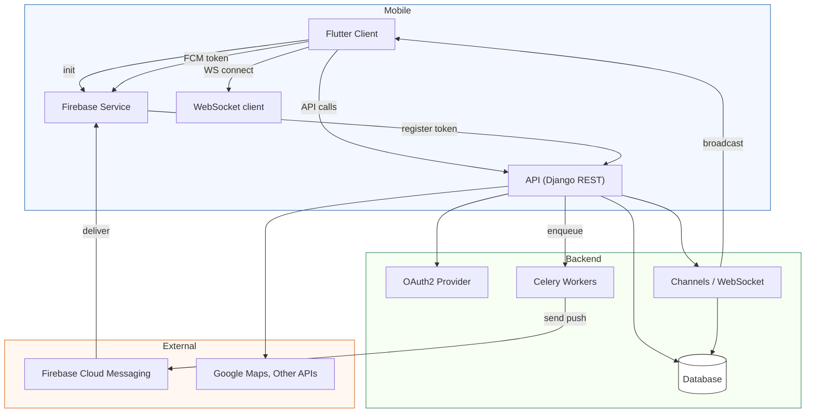

# PlanPal — Client-Server Flow

This document contains two diagrams (Mermaid): a sequence diagram showing typical end-to-end interactions, and a flowchart summarizing main subsystems and their responsibilities. Use a Markdown viewer that supports Mermaid to render these diagrams.

---

## Legend
- `Flutter Client` = mobile app UI + Providers + Repositories
- `Firebase` = Firebase Core + FCM (push) + local notifications
- `API (Django REST)` = planpalapp Django project + DRF endpoints and authentication
- `OAuth2 Provider` = token issuance/revocation (django-oauth-toolkit / oauth2_provider)
- `DB` = relational database (MySQL per repo)
- `Channels / WebSocket` = Django Channels realtime layer for chat
- `Celery` = background tasks (scheduling, notifications)
- `External` = third-party services (FCM, Google Maps, etc.)

---

## Sequence diagram — common flows

```mermaid
sequenceDiagram
  participant Client
  participant Firebase
  participant API
  participant OAuth
  participant DB
  participant Channels
  participant Celery
  participant External

  Note over Client,OAuth: 1) User logs in (credentials)
  Client->>API: POST /auth/login (credentials)
  API->>OAuth: Validate credentials and request token
  OAuth-->>API: access_token + refresh_token
  API-->>Client: 200 OK + token
  Client->>Firebase: initialize() and get FCM token
  Firebase-->>Client: fcm_token
  Client->>API: POST /devices (Authorization: Bearer token) register fcm_token
  API->>DB: store device token

  Note over Client,API: 2) Fetch plans / pagination
  Client->>API: GET /api/plans?cursor=... (Authorization)
  API->>DB: Query plans (ManualCursorPaginator used in service)
  DB-->>API: rows
  API-->>Client: JSON page

  Note over Client,API: 3) Update plan (service-level validation)
  Note over API,DB: PlanService performs DB-level checks and writes
  Client->>API: PUT /api/plans/:id (Authorization, payload)
  API->>API: PlanService.update_plan (check status)
  alt Plan completed
    API-->>Client: 400 ValidationError (DRFValidationError -> JSON)
  else Not completed
    API->>DB: update plan, save activity
    DB-->>API: OK
    API-->>Client: 200 OK + updated plan
    API->>Celery: enqueue notification (optional)
    Celery->>External: send notifications or create events
  end

  Note over Client,Channels,API: 4) Chat message send/receive (realtime)
  Client->>Channels: WebSocket send message
  Channels->>API: receive and persist (ConversationService)
  API->>DB: insert message
  DB-->>API: message saved
  API->>Channels: broadcast to participants
  Channels-->>Client: message pushed (live)

  Note over Channels,External: 5) Offline user -> Push notification path
  Channels->>API: detect offline users -> API enqueues Celery task
  API->>Celery: schedule send_push
  Celery->>External: call FCM send (server key) -> External delivers to Firebase
  External-->>Firebase: deliver push to device
  Firebase-->>Client: onMessage / onMessageOpenedApp

  Note over Client,API,OAuth: 6) Logout (preserve partial success)
  Client->>API: POST /oauth/logout (Authorization)
  API->>DB: select AccessToken (select_for_update inside transaction)
  alt Token found and revoked
    API->>OAuth: revoke token
    API->>DB: set user offline
    API-->>Client: 200 OK { revoked: true }
  else Token revoke failed but offline set
    API-->>Client: 200 OK { revoked: false, partial_success: true }
  else No side-effect
    API-->>Client: 500 Server Error
  end
```

---

## Flowchart — subsystem responsibilities



---

## Notes and mapping to your repo
- Authentication & OAuth2: handled by `planpalapp` (Django) and `oauth2_provider` in repo.
- Plan update logic: performed in service (`planpals/services.py` / `PlanService.update_plan`) and the API layer calls into it. The diagram shows the service-level check ("PlanService.update_plan (check status)") which blocks updates on completed plans.
- Chat: Django Channels + WebSocket consumers in `planpals/consumers.py` and `chat_websocket_service.dart` on the client.
- Push: `planpal_flutter/lib/core/services/firebase_service.dart` registers FCM tokens with the API and receives pushes from Firebase.
- Background tasks: `planpalapp/celery.py` and tasks in `planpals/tasks.py` enqueue notifications and other background work.

---

If you want:
- I can expand any swimlane (e.g., show detailed calls inside PlanService.update_plan or sequence for OAuth token exchange).
- I can add separate diagrams for error handling paths (partial logout, DB transaction failure) or for pagination flows (manual cursor pagination).


